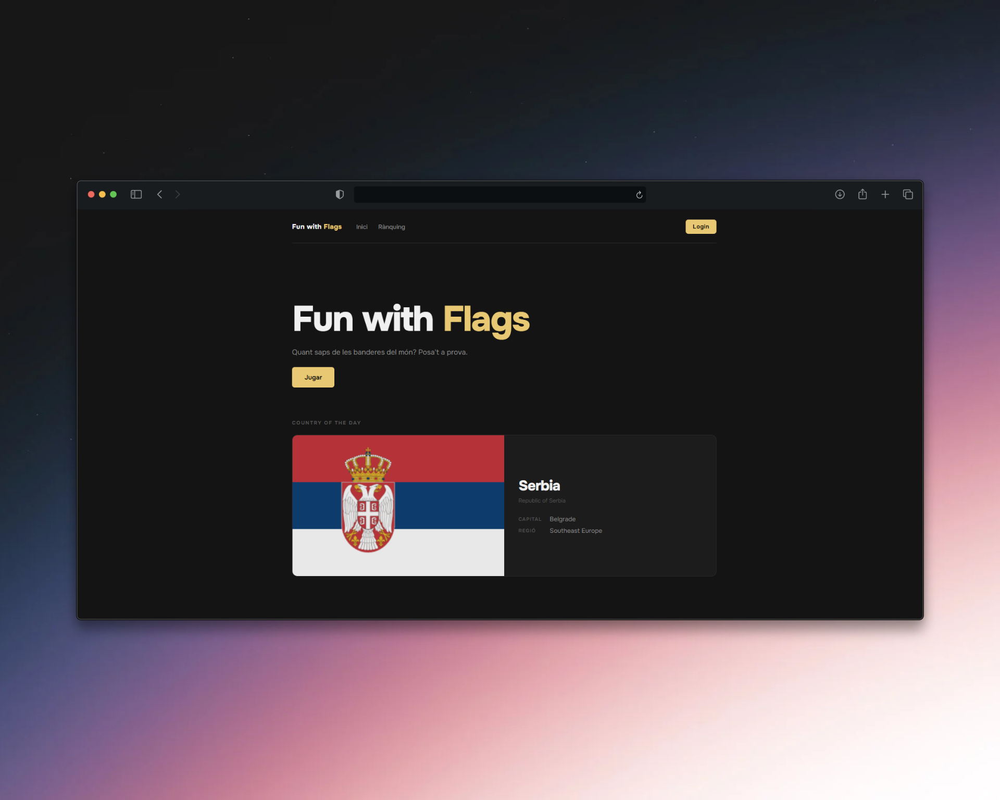
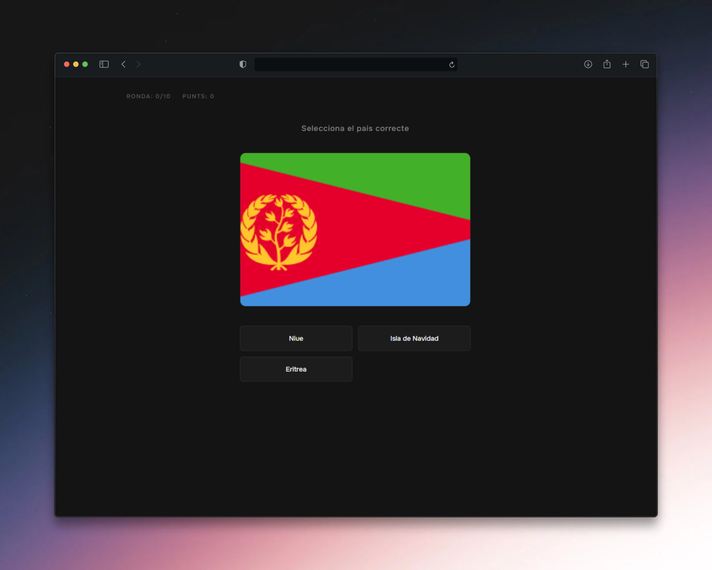
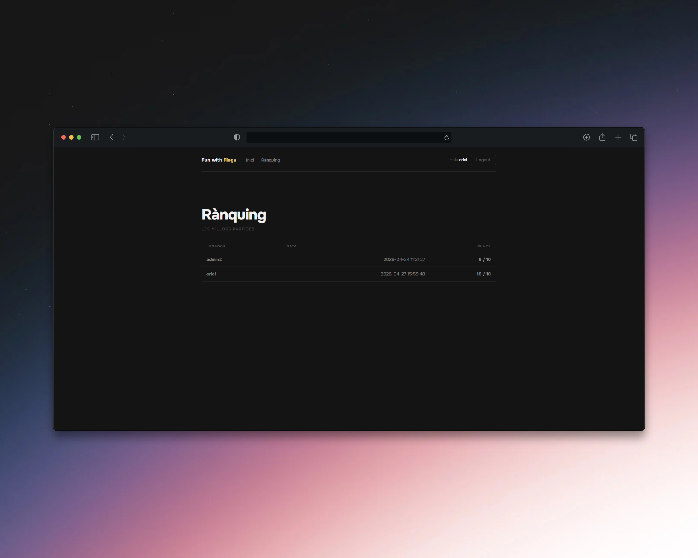
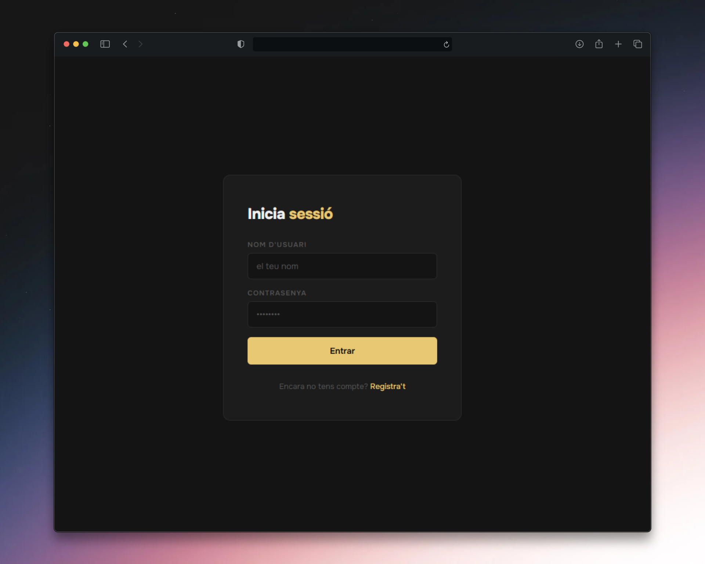

# Fun with Flags

**Un juego interactivo de adivinanza de banderas construido con arquitectura MVC modular y escalable.**


---

## 📋 Descripción del Proyecto

**Fun with Flags** es una aplicación web full-stack que gamifica el aprendizaje de geografía mundial. Los usuarios compiten adivinando países basándose en sus banderas en una serie de 10 rondas, acumulando puntos y siendo registrados en un ranking global.

### Características Principales

- 🎮 **Modo Juego**: 10 rondas con 3 opciones de respuesta por ronda
- 👤 **Sistema de Autenticación**: Login y registro de usuarios en BD y sesiones
- 📊 **Ranking Global**: Tabla de puntuaciones de todos los jugadores ordenada por puntos
- 🌍 **Datos en Tiempo Real**: Integración con API de países para datos actualizados
- 🏆 **Country of The Day**: Sección destacada con un país aleatorio
- 🎨 **Interfaz Responsiva**: Diseño dark-mode optimizado para todos los dispositivos

---

## 🎨 Mockups del Proyecto

Visualiza el diseño de la aplicación en los siguientes mockups:

 - Página principal con hero section y country of the day
 - Interfaz de juego con bandera y opciones de respuesta
 - Tabla de puntuaciones global ordenada por puntos
 - Formulario de autenticación y registro

---

## 🏗️ Arquitectura del Proyecto

El proyecto sigue el **patrón MVC (Model-View-Controller)** con una arquitectura modular altamente escalable. Los controllers en PHP realizan llamadas a las funciones **fetchers desde servidor** tanto a APIs externas como a la propia API interna desarrollada con PHP para acceder a datos de la BD, ejecutando SQL desde el DAO.

### Principios de Diseño

✅ **Separación de Responsabilidades**: Cada capa tiene una función específica
✅ **Fetches desde Servidor**: Lógica de llamadas a APIs en PHP/cURL (seguro y controlado)
✅ **DAO Pattern**: Aísla la lógica SQL del código de endpoints para máxima modularidad
✅ **Inyección de Dependencias**: Controllers reciben sus dependencias
✅ **Reutilización de Código**: Lógica centralizada en controllers y APIs
✅ **Escalabilidad**: Fácil agregar nuevas funcionalidades sin modificar código existente
✅ **Mantenibilidad**: Estructura clara y organizada para equipo de desarrollo

---

## 📂 Estructura de Archivos

```
fun-with-flags/
│
├── 📄 index.php                          # Página principal (home)
├── 📄 README.md                          # Este archivo
│
├── 📁 pages/                             # Vistas (interfaz del usuario)
│   ├── game.php                          # Interfaz del juego (10 rondas)
│   ├── login.php                         # Página de autenticación
│   ├── registre.php                      # Página de registro
│   ├── ranking.php                       # Tabla de puntuaciones global
│   └── logout.proc.php                   # Controlador de cierre de sesión
│
├── 📁 controller/                        # Capa de Control (Lógica de Negocio)
│   ├── gameController.php                # Gestión de partidas y juego
│   ├── countriesController.php           # Lógica de países y datos
│   └── usuarisController.php             # Lógica de usuarios
│
├── 📁 apiClient/                         # Clientes HTTP (Integración)
│   ├── gameApi.php                       # Cliente HTTP para partidas
│   ├── countriesApi.php                  # Cliente HTTP para REST Countries API
│   └── usersApi.php                      # Cliente HTTP para usuarios
│
├── 📁 apiServer/                         # API REST (Backend)
│   └── apiServer.php                     # Endpoints: POST/GET para operaciones
│
├── 📁 model/                             # Modelos de Datos (Clases)
│   ├── Usuari.php                        # Modelo de usuario
│   ├── Partida.php                       # Modelo de partida/juego
│   └── Pais.php                          # Modelo de país
│
├── 📁 dao/                               # Data Access Object (Capa de Persistencia)
│   └── Users_Dao.php                     # Centraliza todo SQL (INSERT, SELECT, etc)
│
├── 📁 db/                                # Base de Datos
│   ├── dbGame.db                         # Base de datos SQLite3
│   └── init.sql                          # Script de inicialización BD
│
├── 📁 include/                           # Configuración e inicialización
│   ├── dbConnection.php                  # Conexión a BD e inyección
│   ├── initCountries.php                 # Inicialización de controllers
│   └── errorHandler.proc.php             # Manejo de errores
│
├── 📁 styles/                            # Hojas de estilos
│   └── styles.css                        # Estilos globales (dark mode)
│
└── 📁 assets/                            # Recursos del proyecto
    ├── home-mockup.png                   # Mockup de página principal
    ├── game-mockup.png                   # Mockup de interfaz de juego
    ├── ranking-mockup.png                # Mockup de tabla de ranking
    └── login-mockup.png                  # Mockup de página de autenticación
```

---

## 🔧 Tecnologías Utilizadas

### Backend

- **PHP 8.0+** - Lenguaje de servidor
- **SQLite3** - Base de datos ligera y embebida
- **cURL** - Cliente HTTP para consumo de APIs

### Frontend

- **HTML5** - Marcado semántico
- **CSS3** - Estilos con soporte dark-mode
- **PHP** - Lógica de presentación en servidor (sin JavaScript)

### Integraciones Externas

- **REST Countries API** - Datos de países, banderas y ubicaciones en tiempo real
- **cURL** - Cliente HTTP para fetches desde PHP a APIs externas

### Arquitectura

- **MVC** - Patrón arquitectónico modelo-vista-controlador
- **DAO Pattern** - Centralización de lógica SQL (evita SQL disperso en endpoints)
- **REST API** - Comunicación cliente-servidor
- **cURL en Backend** - Fetches seguros desde servidor (sin exponer lógica en cliente)

---

## 🚀 Cómo Ejecutar el Proyecto

### Requisitos Previos

- PHP 8.0 o superior
- Servidor web PHP integrado (incluido en PHP)
- Conexión a Internet (para API externa de países)

### Instalación

1. **Clonar/descargar el proyecto**

   ```bash
   cd fun-with-flags
   ```

2. **Inicializar la base de datos** (automático en primera ejecución)
   La base de datos SQLite3 se crea automáticamente con la estructura necesaria.

3. **Iniciar el servidor**

   ```bash
   PHP_CLI_SERVER_WORKERS=4 php -S localhost:8000
   ```

   ⚠️ **Nota importante**: Se utiliza `PHP_CLI_SERVER_WORKERS=4` (4 workers) porque el proyecto realiza múltiples llamadas a APIs externas (REST Countries) y requiere procesamiento simultáneo. Un solo worker causaría bloqueos.

4. **Acceder a la aplicación**
   - URL: `http://localhost:8000`
   - Desde cualquier navegador moderno

---

## 🎮 Endpoints de la API

| Método | Endpoint           | Descripción        | Parámetros          |
| ------ | ------------------ | ------------------ | ------------------- |
| POST   | `?action=register` | Registrar usuario  | `nom`, `password`   |
| POST   | `?action=login`    | Autenticar usuario | `nom`, `password`   |
| POST   | `?action=saveGame` | Guardar puntuación | `idUsuari`, `punts` |
| GET    | `?action=getGames` | Obtener ranking    | -                   |

---

## 📈 Escalabilidad

La arquitectura modular permite fácil expansión:

- **Nuevas funcionalidades**: Agregar controllers y models sin afectar código existente
- **Nuevas APIs**: Crear nuevos clients en `apiClient/` para integrar más servicios externos o internos
- **Persistencia agnóstica**: Cambiar de SQLite a MySQL/PostgreSQL modificando solo `Users_Dao.php` (SQL centralizado aquí, no disperso en endpoints)
- **Más endpoints**: Extender `apiServer.php` sin tocar la lógica de DAO
- **Frontend**: Mantener los endpoints API iguales, cambiar interfaz sin afectar backend

---

## 👥 Colaboradores

- **Oriol Plazas** - Desarrollo Backend/Arquitectura
- **Daniel Guillamon** - Desarrollo Backend/Arquitectura

_Última actualización: Abril 2026_
